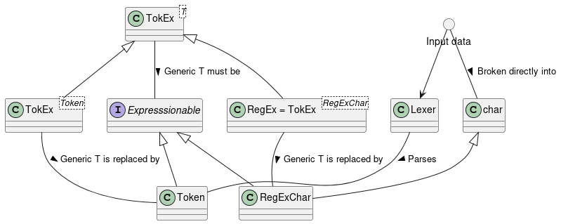
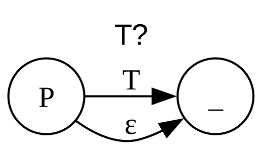
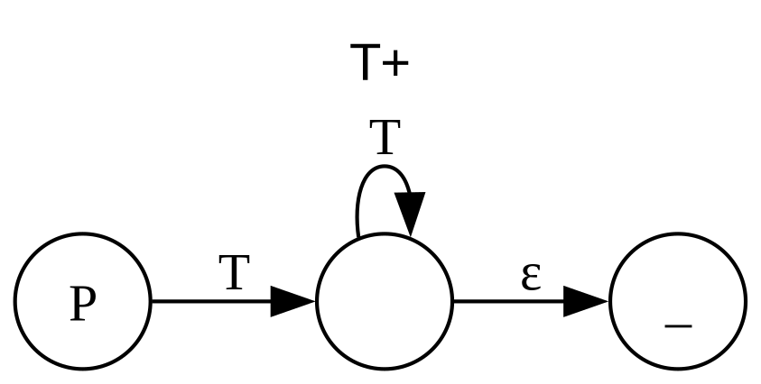
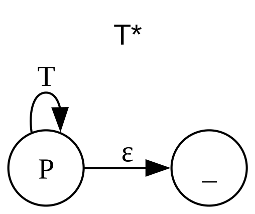
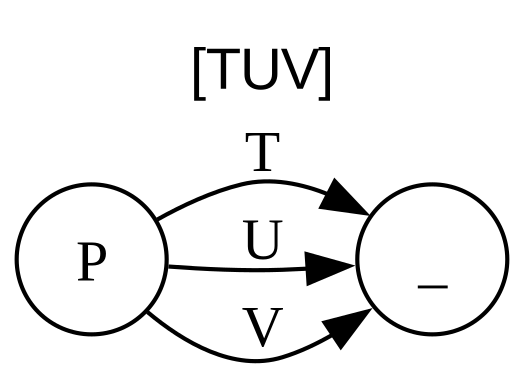
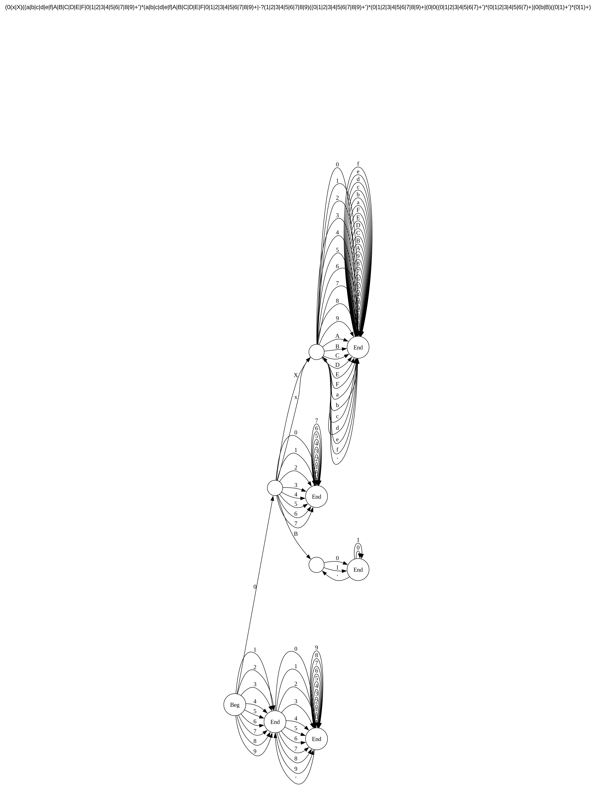

# Final Project for Programming Languages: RegEx -> DFA compiler

Jordan Dehmel, 2024

Programming languages at CMU under Dr. Warren MacEvoy

## About

This software was produced as a final project for Programming
Languages under Dr. Warren MacEvoy at Colorado Mesa University.
It is a regular expression compiler, targetting DFA. It goes
through the following steps:

- Break input regular expression into subexpressions
- Compile each subexpression into an $\epsilon$-NFA
- Knit $\epsilon$-NFAs into a single expression (also an
    $\epsilon$-NFA)
- Remove epsilon transitions to bring the expression to DFA form
- Remove dead nodes from DFA

## How to use

This software has dependencies on the following piece(s) of
software:
- `g++` 20 or later
- `clang-format`
- `graphviz` / `dot`
- `plantuml`
- `make`

On Linux:
```sh
# Compile and run unit tests
make run
```

This can be used in `C++` programs by including `regex.hpp` or
`regex_manager.hpp`.

## Diagrams

Class diagram


## Translation Diagrams







## Examples




## License

This software is licensed under the GPLv3.
